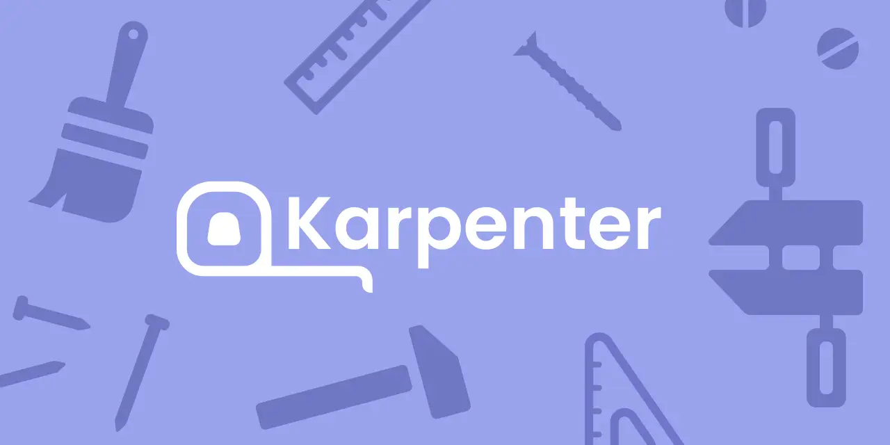
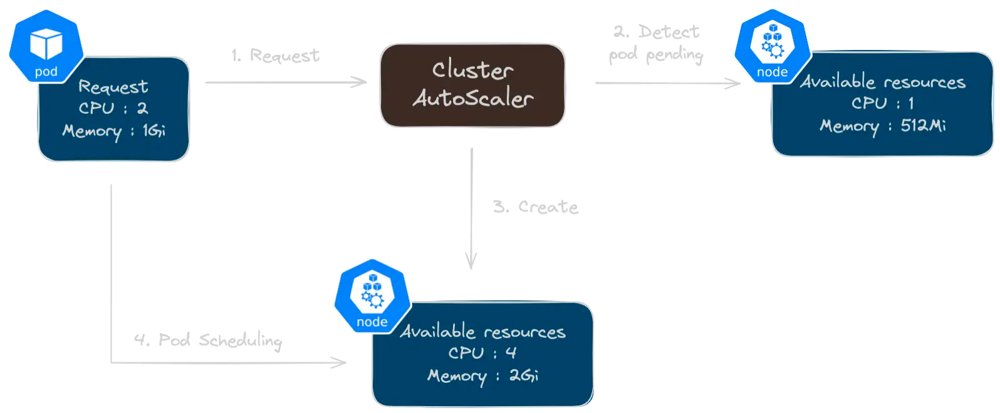
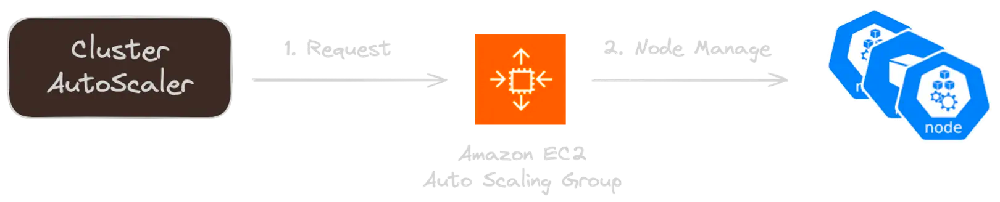
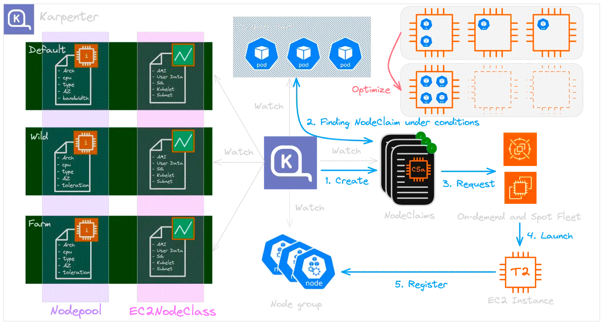

> 아래의 Reference 에 있는 악분 일상 및 공식 문서를 통해 2024년 8월 14일 공식 버전 1.0.0 기준으로 재구성하여 기록하였습니다.
> https://aws.amazon.com/about-aws/whats-new/2024/08/karpenter-1-0/?nc1=h_ls

# What is cluster autoscaler?

> If you're using a cluster autoscaler, it monitors the CPU and memory required by the pods and makes resources available if they're running low to keep the pods running.
>
>Slow to create node, depend on launch template
# [Karpenter](https://docs.aws.amazon.com/eks/latest/userguide/autoscaling.html)
> Kapenter is a flexible, high-performance Kubernetes cluster autoscaler
> pros
> - launches right-sized compute resources in response to changing application load in under a minute
> - Automatically provisions new compute resources based on the specific requirements of cluster workloads

## Workflow

1. **NodePool and EC2NodeClass**
    - **NodePool**: Karpenter manages multiple NodePools to cater to different workload requirements, such as `Default`, `Wild`, and `Farm`.
    - Each NodePool has properties like `Arch`, `CPU`, `Type`, `AZ`, and `Toleration`, allowing it to provision nodes that meet specific workload needs.
    - **EC2NodeClass**: Linked to each NodePool, EC2NodeClass holds configurations such as AMI, User Data, Security Group, Kubelet settings, and Subnet information, which guide the provisioning of EC2 instances for the nodes.
2. **Monitoring Pending Pods**
    - Karpenter watches for Pods in a **Pending** state within the cluster. If pods remain pending due to a lack of available nodes, Karpenter initiates a process to provision new nodes.
3. **Creating NodeClaims**
    - After detecting pending pods, Karpenter generates suitable **NodeClaims**. NodeClaims define the specifications of the required nodes according to the workload needs and associated conditions.
4. **Requesting EC2 Instances**
    - Based on the NodeClaim, Karpenter requests the necessary EC2 instance from the AWS EC2 service. This request can be for **On-Demand** or **Spot Instances** depending on the configuration. Each NodeClaim specifies the required instance type (CPU, memory, etc.), which directs this request.
5. **Launching and Registering EC2 Instances**
    - Once the request is accepted, the EC2 instance is launched and registered as a node according to the NodeClaim.
    - Through this process, Karpenter dynamically scales and optimizes resources within the cluster by automatically managing node provisioning based on workload demands.

For more code and explanation, see the blog below.

[Karpenter Main Pages](https://publish.obsidian.md/rynforce/DevOps/Kubernetes/Karpenter+Main+page)
